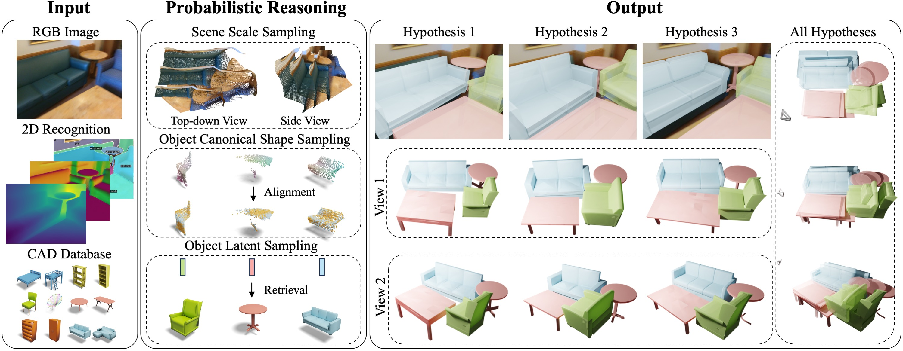

# DiffCAD: Weakly-Supervised Probabilistic CAD Model Retrieval and Alignment from an RGB Image
[](https://arxiv.org/abs/2311.18610)
[](https://daoyig.github.io/DiffCAD/) 

[Daoyi Gao](https://daoyig.github.io/), [Dávid Rozenberszki](https://rozdavid.github.io/), [Stefan Leutenegger](https://srl.cit.tum.de/members/leuteneg), and [Angela Dai](https://www.3dunderstanding.org/index.html)

DiffCAD proposed a weakly-supervised approach for CAD model retrieval and alignment from an RGB image. Our approach utilzes disentangled diffusion models to tackle the ambiguities in the monocular perception, and achives robuts cross-domain performance while only trained on synthetic dataset.




## Environment

We tested with Ubuntu 20.04, Python 3.8, CUDA 11, Pytorch 2.0

### Dependencies

We provide an Anaconda environment with the dependencies, to install run

```
conda env create -f env.yaml
```

## Available Resources

### Data
We provide our synthetic 3D-FRONT data rendering (RGB, rendered/predicted depth, mask, camera poses); processed watertight ([mesh-fusion](https://github.com/autonomousvision/occupancy_networks/tree/master/external/mesh-fusion)) and canonicalized meshes (ShapeNet and 3D-FUTURE), and their encoded latent vectors; machine estimated depth and masks on the validation set of ScanNet25k data. However, since the rendered data will take up large storage space, we also encourage you to generate the synthetic data rendering yourself following [BlenderProc](https://github.com/DLR-RM/BlenderProc) or [3DFront-Rendering](https://github.com/yinyunie/BlenderProc-3DFront).

| **Source Dataset**  |       **Description**        |
|--------------------| --------------|
| [3D-FRONT-CONFIG](https://syncandshare.lrz.de/getlink/fiMLEHNEu87SA4gTHcQkuB/3D-FRONT-CONFIG) | Scene config for rendering, we also augment it with ShapeNet objects. |
| [3D-FRONT-RENDERING](https://syncandshare.lrz.de/getlink/fiQUDhpSxJV3HJjQx66Ngb/3D-FRONT-RENDER) | Renderings of 3D-FRONT dataset for each target category. |
| [Object Meshes](https://syncandshare.lrz.de/getlink/fiQWpWzs5qSeXrt2JStEbT/Mesh)  | Canonicalized and watertighted mesh of ShapeNet and 3D-FUTURE. |
| [Object Meshes - AUG](https://syncandshare.lrz.de/getlink/fiAhSmZduitQM8FeLEU4Yy/Mesh-AUG)  | ShapeNet object but scaled by its NN 3DF object scale, which we use to augment the synthetic dataset. |
| [Object Latents](https://syncandshare.lrz.de/getlink/fi53KQjYS2MJgKdgc3zzAo/Latents) |  Encoded object latents for retrieval. |
| [Val ScanNet25k](https://syncandshare.lrz.de/getlink/fiKQasexdTsyRfqQV6YQSU/Scan2CAD_processed) | Predict depth, GT and predicted masks, CAD pools, pose gts on the validation set. |
| [ScanNet25k data](https://drive.google.com/drive/folders/1JbPidWsfcLyUswYQsulZN8HDFBTdoQog) | The processed data from [ROCA](https://github.com/cangumeli/ROCA) |


## Pretrained Checkpoint
We also provide the checkpoints for scene scale, object pose, and shape diffusion models.
| **Source Dataset** |                     |
|--------------------|-------------------|
| Scale | [Joint category ldm model](https://syncandshare.lrz.de/getlink/fiEuyDe5EusDujuetyk9UN/scale) |
| Pose | [Category-specific ldm model](https://syncandshare.lrz.de/getlink/fiSMR6RAwVS5ucGh2e9Mvu/pose) |
| Shape | [Category-specific ldm model](https://syncandshare.lrz.de/getlink/fiEdb3iPSjPg8QdcAnJ7ou/shape) |


## Training
For scene scale:

```python train_scale.py --base=configs/scale/depth_feat.yaml -t --gpus=0, --logdir=logs```

For object NOCs:

```python train_pose.py --base=configs/pose/depth_gcn.yaml -t --gpus=0, --logdir=logs```

For object latents:

```python train_shape.py --base=configs/shape/nocs_embed.yaml -t --gpus=0, --logdir=logs```


## Inference

For scene scale sampling:
```
python scripts/generate_multi_scale_candidates.py --config_path weights/scale/scale.yaml --model_path weights/scale/scale.ckpt --data_path datasets/Scan2CAD --split_path splits/scale/val_joint.txt --outdir output --num_iters 5
```

For object NOCs generation (per category):
```
python scripts/generate_multi_nocs_candidates.py --category 02818832 --config_path weights/pose/pose.yaml --model_path weights/pose/02818832.ckpt --data_path datasets/Scan2CAD --split_path splits/pose/02818832/val_nonocc_centroid_maskexist.txt --outdir output/nocs --num_iters 5 --pred_scale_dir output/scale/predictions.json
```

For alignment (per category):
```
python scripts/alignment_from_nocs.py --category 02818832 --prediction_path output/nocs/02818832 --pose_gt_root datasets/Scan2CAD/val_pose_gt/scan2cad_val_02818832.json --mesh_root /project/3dlg-hcvc/diorama/diffcad/object_meshes/02818832 --split_path splits/pose/02818832/val_nonocc_centroid_maskexist.txt --outdir output/pose --num_iters 5
```

For object latent sampling:
```
python scripts/generate_multi_shape_candidates.py --category 02818832 --config_path weights/shape/shape.yaml --model_path weights/shape/02818832.ckpt --data_path datasets/Scan2CAD --split_path splits/shape/02818832/val_nonocc_centroid_maskexist.txt --outdir output 
```


## BibTeX

```
@article{gao2023diffcad,
title= {DiffCAD: Weakly-Supervised Probabilistic CAD Model Retrieval and Alignment from an RGB Image},
author={Gao, Daoyi and Rozenberszki, David and Leutenegger, Stefan and Dai, Angela},
booktitle={ArXiv Preprint},
year={2023}
}

```

## Reference
We borrow [latent-diffusion](https://arxiv.org/abs/2112.10752) from the [official implementation](https://github.com/CompVis/latent-diffusion).
